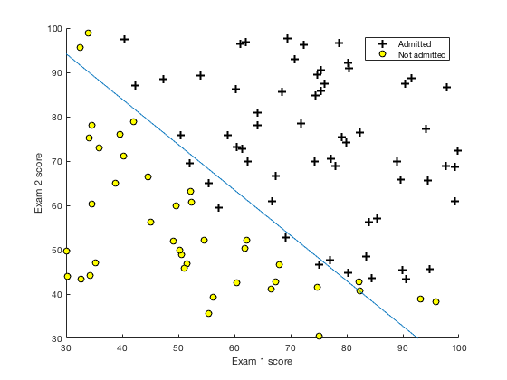
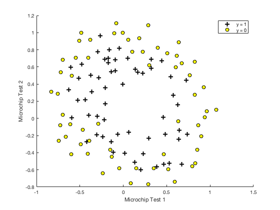
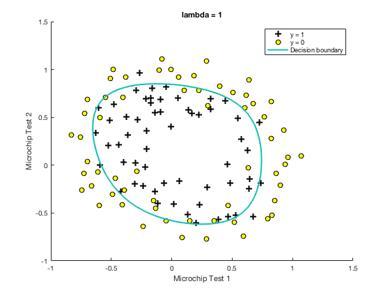

# Machine Learning
# Linear Regression 

Used Single variable Linear Regression, to estimate profits of food truck with respect to the population. 

Best fit for h= theta0 + theta1 * X

Program choose theta0 and theta1 with minimum cost value using gradient descent. 

choose global min. using gradient descent. Countour plot visualizes this for us 

# Logistic Regression 

Useful for classification problems. In this exercise, used logistic regression to predict students accpetance rate based on exam 1 and 2 scores (2 features). 

Program can predict with 89% confidence score. As seen from the picture a line clearly seperates + and - values 

This data is not linear, to add boundary need to scale feactures. Used 6 DOF and regularized them to not to overfit the data. 
Result looks this the picture below.

