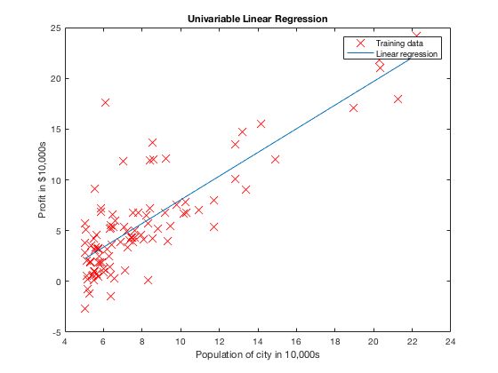
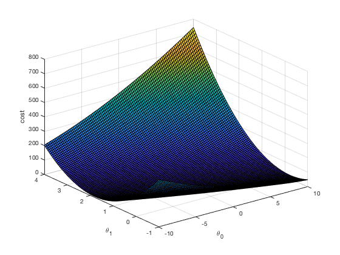
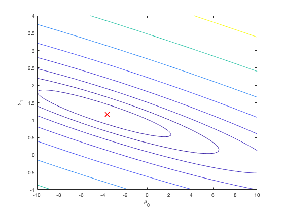

# MachineLearning
# Linear Regression 

Used Single variable Linear Regression, to estimate profits of food truck with respect to the population. 

Best fit for h= theta0 + theta1 * X

Program choose theta0 and theta1 with minimum cost value using gradient descent. 

choose global min. using gradient descent. Countour plot visualizes this for us 

