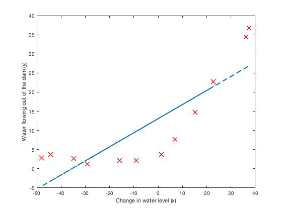
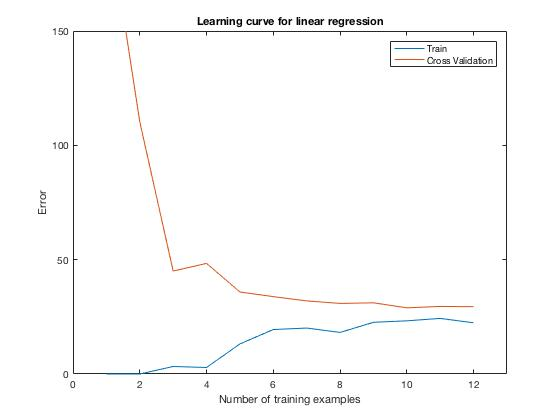
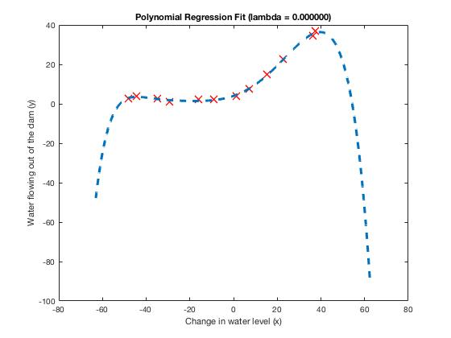
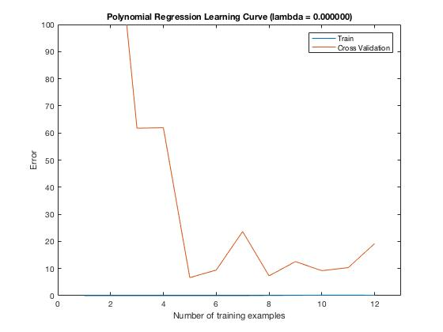
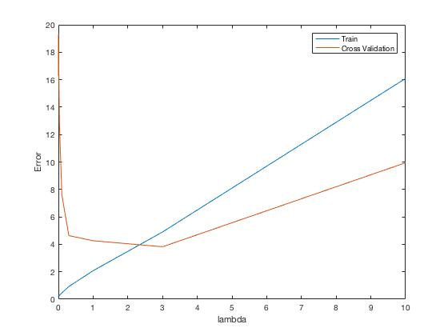

# Machine Learning
# Linear Regression 

Used Single variable Linear Regression, to estimate profits of food truck with respect to the population. 

Best fit for h= theta0 + theta1 * X

Program choose theta0 and theta1 with minimum cost value using gradient descent. 

choose global min. using gradient descent. Countour plot visualizes this for us 

# Logistic Regression 

Useful for classification problems. In this exercise, used logistic regression to predict students accpetance rate based on exam 1 and 2 scores (2 features). 

Program can predict with 89% confidence score. As seen from the picture a line clearly seperates + and - values 

This data is not linear, to add boundary need to scale feactures. Used 6 DOF and regularized them to not to overfit the data. 
Result looks this the picture below.

# Learning curves
Used to identify the if the learning algorithm sufferes from hig bias (underfitting) or high variance (overfitting).

Linear regression is applied to the non-linear data. Below is the result 

Learning curve is generated from training set and validation set cost functions 
 

From the graph above, errors increase as the number of training set increases . graphs. This indicates high bias problem. To fix introduce more features. Such as polynomial fit instead of linear. 

For polynomial regression and lambda=0 (no regulization)

From the graphs above, we can deduce that the learning algorithm overfits the data (high variance). By increasing or decreasing lambda fixes this problem. 

lambda={0; 0:001; 0:003; 0:01; 0:03; 0:1; 0:3; 1; 3; 10}, array of lamda values are used to graph and select the lambda that best fits the data. 

From the graph best lambda is 3

